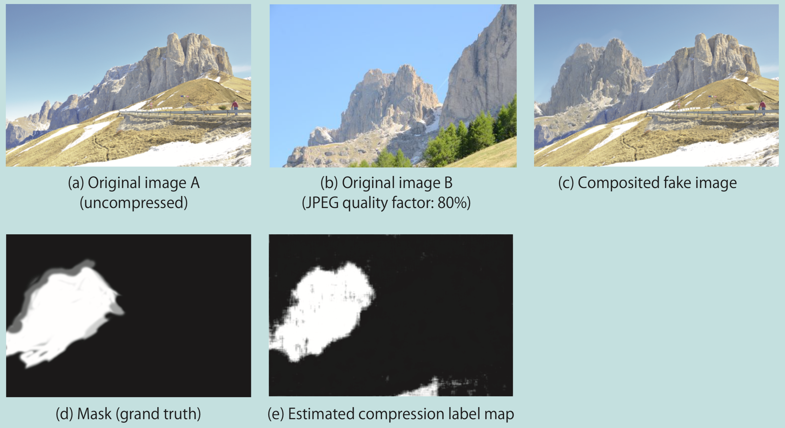

# [Pixelwise JPEG Compression Detection and Quality Factor Estimation Based on Convolutional Neural Network](https://www.ingentaconnect.com/contentone/ist/ei/2019/00002019/00000011/art00026)

## Contents

**tamperedRegionLocalization**:  demo scripts: `localizeTamperedRegion.py`.

## Proposed Method

- Network structure
   
- Performance on JPEG quality factor estimation
   
- Performance on JPEG degradation detection
   
- Detection of JPEG-compressed region in a fake image
   
- JPEG quality assessment for Set14
  

## Abstract

JPEG compression is one of image degradations that often occurs in image storing and retouching process. Estimating JPEG compression degradation property is important for JPEG deblocking algorithm and image forensic analysis. JPEG degradation exists not only in JPEG file format but also in other image formats because JPEG distortion remains after converting to another image format. Moreover, JPEG degradation property is not always uniform within an image in case that the image is collaged from different JPEG-compressed photos. In this paper, pixelwise detection of JPEG-compression degradation and estimation of JPEG quality factor using a convolutional neural network is proposed. The proposed network outputs an estimated JPEG quality factor map and a compression flag map from an input image. Experimental results show that the proposed network successfully infers the quality factors and discriminates between non-JPEG-compressed images and JPEG-compressed images. We also demonstrate that the proposed network can spot a collaged region in a fake image which is comprised of images that have different JPEG compression properties. Additionally, the network reveals that image datasets Set5 and Set14, often used to evaluate super-resolution algorithms, contain JPEG-compressed low quality images, which are inappropriate for such evaluation.

## Citation

```
@article{uchida2019pixelwise,
  title={Pixelwise JPEG compression detection and quality factor estimation based on convolutional neural network},
  author={Uchida, Kazutaka and Tanaka, Masayuki and Okutomi, Masatoshi},
  journal={Electronic Imaging},
  volume={2019},
  number={11},
  pages={276--1},
  year={2019},
  publisher={Society for Imaging Science and Technology}
}
```
